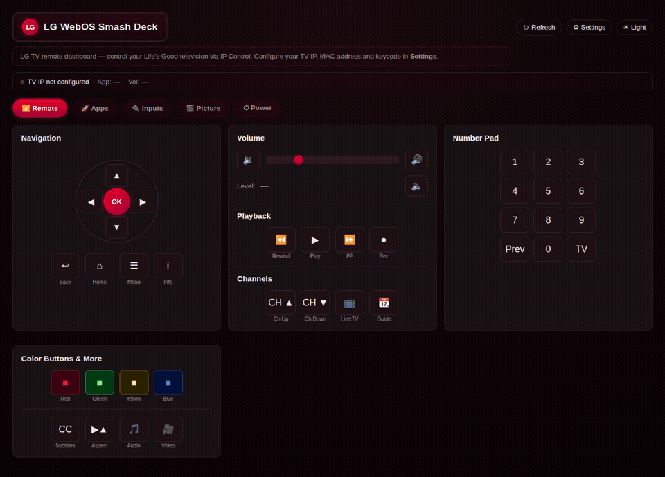

# LG WebOS Smash Deck

A small **Go** web app and REST API to control LG TVs over the network using LG’s **Network IP Control** protocol (TCP port 9761, AES when a keycode is configured). The UI is a single vanilla-JS dashboard styled with LG brand colors and dark/light themes.



## Features

- **Remote**: D-pad, volume (slider uses sequential key presses for HDMI CEC / soundbars), playback, channels, color buttons, number pad  
- **Apps**: Launch common streaming apps and custom app IDs  
- **Inputs**: HDMI, AV, tuner sources  
- **Picture**: Picture mode, screen mute, energy saving  
- **Power**: Wake-on-LAN and IP power off  
- **Settings**: TV IP, MAC (with fetch-from-TV), keycode, max volume cap, activity log  

Everything is available from the **CLI** (same binary), **REST JSON API**, and **web UI**.

## Requirements

- **Go** 1.22+ (module uses 1.25)  
- LG TV with **Network IP Control** enabled and an 8-character keycode (see Settings help in the app)  
- Optional: **ffmpeg** to build the demo GIF from Playwright screenshots  

## Quick start

```bash
git clone https://github.com/niski84/lg-webos-smash-deck.git
cd lg-webos-smash-deck
go run ./cmd/lgdeck
```

Open [http://localhost:8088](http://localhost:8088), open **Settings**, enter TV IP and keycode, then **Save**.

### Environment

| Variable    | Description        | Default   |
|------------|--------------------|-----------|
| `PORT`     | HTTP listen port   | `8088`    |
| `TV_IP`    | TV address         | (from file) |
| `TV_MAC`   | MAC for Wake-on-LAN | (optional) |
| `TV_KEYCODE` | 8-char IP control key | (from file) |
| `DATA_DIR` | Config + logs dir  | `./data`  |

Settings are stored in `DATA_DIR/lgdeck-settings.json` (create `data/` or set `DATA_DIR`).

### Build binary

```bash
go build -o lgdeck ./cmd/lgdeck
./lgdeck
```

### API smoke test

```bash
./scripts/verify_api.sh
```

## REST API (examples)

Base URL: `http://localhost:8088` (adjust port as needed).

- `GET /api/state` — reachability, app, volume, mute  
- `GET /api/volume` — current volume  
- `POST /api/volume` — set volume (body `{"level": N}`)  
- `POST /api/volume/stream` — SSE stream while adjusting volume (slider)  
- `POST /api/key` — `{"key": "volumeup"}`  
- `POST /api/app` — `{"app": "netflix"}`  
- `GET|POST /api/settings` — configuration  
- See `internal/lgdeck/http_server.go` for the full route list  

Responses use JSON with `success`, `data`, and `error` fields where applicable.

## Demo GIF (Playwright)

Captures each main screen (tabs + Settings) and builds `docs/demo.gif`.

**Prerequisites:** Node.js, `ffmpeg` on `PATH`.

```bash
cd e2e && npm install && npx playwright install chromium
cd .. && ./scripts/generate-demo-gif.sh
```

Or run the test only (frames land in `e2e/screenshots/frames/`):

```bash
cd e2e && npx playwright test demo-gif
```

The Playwright config starts the Go server on port **18765** by default (`LGDECK_E2E_PORT` overrides) so it does not clash with a dev server on `8088`.

## Project layout

```
cmd/lgdeck/          # main entrypoint
internal/lgdeck/     # TV client, crypto, HTTP API, config
web/lgdeck/          # embedded static UI
e2e/                 # Playwright tests + GIF pipeline
scripts/             # verify_api.sh, reload.sh, generate-demo-gif.sh
```

## License

[MIT](LICENSE)

## Acknowledgements

Protocol behavior aligns with community implementations such as [lgtv-ip-control](https://github.com/WesSouza/lgtv-ip-control) and LG’s IP Control documentation.
