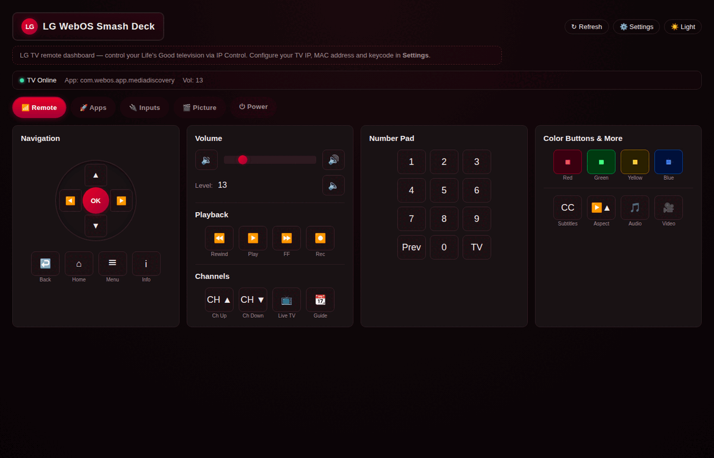

# LG WebOS Smash Deck



Full LG TV remote control over the local network — no app, no cloud, no IR blaster. Speaks LG's Network IP Control protocol (TCP port 9761, AES-encrypted when a keycode is set) and exposes a dark-mode web dashboard, a REST API, and a CLI in a single Go binary.

Part of the [Smash Deck](https://github.com/niski84/smash-deck-catalog) family of self-hosted homelab dashboards.

## Features

- **Virtual remote** — D-pad, OK, back, home, color buttons, number pad
- **Volume control** — slider with sequential key presses so HDMI CEC and soundbars track correctly; mute toggle
- **Input switching** — HDMI 1–4, tuner, and any connected source
- **App launcher** — launch streaming apps by app ID (Netflix, YouTube, Prime, etc.)
- **Picture & display** — picture mode presets, screen mute, energy saving toggle
- **Wake-on-LAN** — power on the TV remotely
- **Activity log** — every action timestamped in a local log
- **REST API + CLI** — scriptable; wire the TV into Home Assistant or any automation

## API

| Method | Path | Description |
|--------|------|-------------|
| `GET/POST` | `/api/settings` | Read/write TV connection settings |
| `GET` | `/api/state` | Current TV state |
| `POST` | `/api/power` | Power on/off |
| `GET/POST` | `/api/volume` | Get/set volume |
| `GET` | `/api/volume/stream` | SSE stream of volume changes |
| `POST` | `/api/mute` | Toggle mute |
| `POST` | `/api/key` | Send any remote key code |
| `POST` | `/api/input` | Switch input source |
| `POST` | `/api/app` | Launch app by ID |
| `POST` | `/api/picture` | Set picture mode |
| `POST` | `/api/energy` | Toggle energy saving |
| `POST` | `/api/screenmute` | Blank/unblank the screen |
| `GET` | `/api/logs` | Tail the activity log |
| `GET` | `/api/macaddress` | Retrieve TV MAC address |

## Running

```bash
bash scripts/reload.sh
```

Or build manually:

```bash
go build -o lgdeck ./cmd/lgdeck && ./lgdeck
```

### Configuration

Set via environment variables or through the **Settings** tab in the UI. Settings persist to `DATA_DIR/lgdeck-settings.json`.

| Variable | Default | Description |
|----------|---------|-------------|
| `PORT` | `8088` | Listen port |
| `TV_IP` | — | LG TV IP address |
| `TV_MAC` | — | TV MAC address (for Wake-on-LAN) |
| `TV_KEYCODE` | — | 8-char AES keycode (from TV settings) |
| `DATA_DIR` | `.` | Directory for settings persistence |

## Stack

- Go — single binary, no runtime dependencies
- `golang.org/x/crypto` — AES keycode encryption
- Embedded vanilla HTML/CSS/JS — no framework, no build step

## License

MIT
